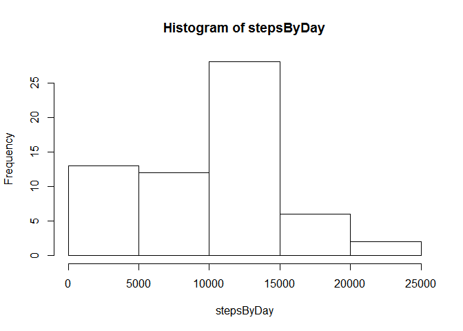
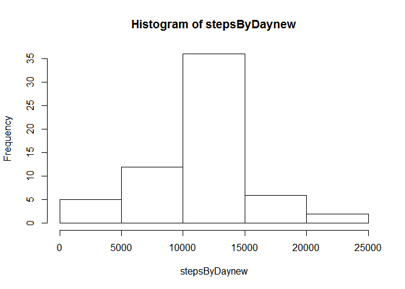
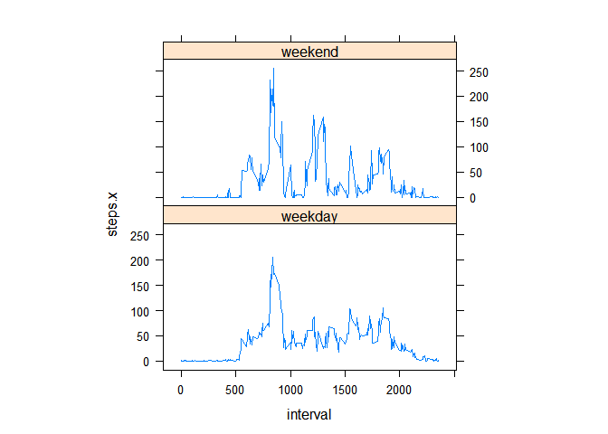

# activity
Aparna  
September 30, 2016  

Reading CSV file and checking it

Loading and preprocessing the data


```r
activitydata <- read.table("D:/R learning/rep research/activity.csv", sep =  "," , header = TRUE) 
head(activitydata)
```

```
##   steps      date interval
## 1    NA 10/1/2012        0
## 2    NA 10/1/2012        5
## 3    NA 10/1/2012       10
## 4    NA 10/1/2012       15
## 5    NA 10/1/2012       20
## 6    NA 10/1/2012       25
```

```r
str(activitydata)
```

```
## 'data.frame':	17568 obs. of  3 variables:
##  $ steps   : int  NA NA NA NA NA NA NA NA NA NA ...
##  $ date    : Factor w/ 61 levels "10/1/2012","10/10/2012",..: 1 1 1 1 1 1 1 1 1 1 ...
##  $ interval: int  0 5 10 15 20 25 30 35 40 45 ...
```
What is mean total number of steps taken per day?

1. Calculate the total number of steps taken per day

```r
stepsByDay <- tapply(activitydata$steps, activitydata$date, sum, na.rm=TRUE)
```

2. Make a histogram of the total number of steps taken each day

```r
hist(stepsByDay)
```

<!-- -->

3.Calculate and report the mean and median of the total number of steps taken per day

```r
mean(stepsByDay)
```

```
## [1] 9354.23
```

```r
median(stepsByDay)
```

```
## [1] 10395
```

What is the average daily activity pattern?

1.Make a time series plot (i.e. type = "l") of the 5-minute interval (x-axis) and the average number of steps taken, averaged across all days (y-axis)
Which 5-minute interval, on average across all the days in the dataset, contains the maximum number of steps?

```r
stepsInterval <- aggregate(steps ~ interval, data = activitydata, mean, na.rm = TRUE)
plot(steps ~ interval, data = stepsInterval, type = "l")
```

<!-- -->

```r
maxsteps <- max(stepsInterval$steps)

maxdata<- stepsInterval[stepsInterval$steps == maxsteps, ]
intervalmax <- maxdata[ ,1]
intervalmax
```

```
## [1] 835
```

1. Calculate and report the total number of missing values in the dataset (i.e. the total number of rows with NAs)

```r
missdata<- activitydata[activitydata$steps == "NA", ]
nrow(missdata)
```

```
## [1] 2304
```
2. Filling in all of the missing values in the dataset by the mean for that 5-minute interval & create a new dataset that is equal to the original dataset but with the missing data filled in.


```r
combo<- merge(x = activitydata, y = stepsInterval, by = "interval", all.x = TRUE)
combo$steps.x [is.na(combo$steps.x)] <- combo$steps.y[is.na(combo$steps.x)]
str(combo)
```

```
## 'data.frame':	17568 obs. of  4 variables:
##  $ interval: int  0 0 0 0 0 0 0 0 0 0 ...
##  $ steps.x : num  1.72 0 0 0 0 ...
##  $ date    : Factor w/ 61 levels "10/1/2012","10/10/2012",..: 1 47 21 58 48 38 13 39 59 49 ...
##  $ steps.y : num  1.72 1.72 1.72 1.72 1.72 ...
```
Make a histogram of the total number of steps taken each day and Calculate and report the mean and median total number of steps taken per day. Do these values differ from the estimates from the first part of the assignment? What is the impact of imputing missing data on the estimates of the total daily number of steps?

```r
stepsByDaynew <- tapply(combo$steps.x, combo$date, sum, na.rm=TRUE)
hist(stepsByDaynew)
```

<!-- -->

```r
mean(stepsByDaynew)
```

```
## [1] 10766.19
```

```r
median(stepsByDaynew)
```

```
## [1] 10766.19
```
Mean and Median have gone up and are equal to each other.

Are there differences in activity patterns between weekdays and weekends?

1.Create a new factor variable in the dataset with two levels - "weekday" and "weekend" indicating whether a given date is a weekday or weekend day.

```r
tt<- as.POSIXlt(as.Date(combo$date))
combo$dateType <-  ifelse(tt$wday %in% c(0,6), 'weekend', 'weekday')
```
Make a panel plot containing a time series plot (i.e. type = "l") of the 5-minute interval (x-axis) and the average number of steps taken, averaged across all weekday days or weekend days (y-axis)

```r
comboaverage <- aggregate(steps.x ~ interval + dateType, data=combo, mean)
library(lattice)
xyplot(steps.x ~ interval | factor(dateType), data = comboaverage, aspect = 1/2, 
    type = "l")
```

<!-- -->
